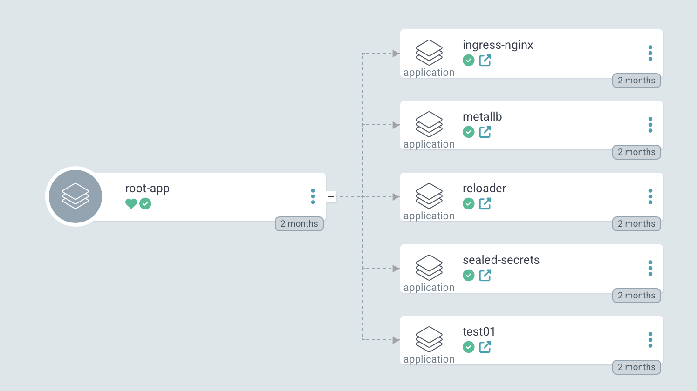

# Argo CD application definitions

The "app of apps" pattern is a method used in Argo CD to manage multiple applications as a single application.  
This pattern involves creating a root application that references other applications allowing you to manage and deploy
them collectively.

In the provided `seeding-root-app.yaml` file, the root-app is an example of the "app of apps" pattern. It defines a root
application that manages other applications specified in the `argocd-apps` directory.

For more details on the "app of apps" pattern, refer to
the [official documentation](https://argo-cd.readthedocs.io/en/latest/operator-manual/cluster-bootstrapping/).

To ensure separation of concerns three repositories are used to manage the Argo CD setup:

* Argo CD installation and
  configuration: [https://github.com/wim-vdw/argocd-setup](https://github.com/wim-vdw/argocd-setup)
* Argo CD application definitions: [https://github.com/wim-vdw/argocd-apps](https://github.com/wim-vdw/argocd-apps)
* Kubernetes manifests or Helm charts used by Argo CD
  applications: [https://github.com/wim-vdw/argocd-k8s-resources](https://github.com/wim-vdw/argocd-k8s-resources)

## Usage

Apply the Argo CD root-app in the `argocd` namespace:

```bash
kubectl apply -f argocd-apps/seeding-root-app.yaml -n argocd
```

## Example


